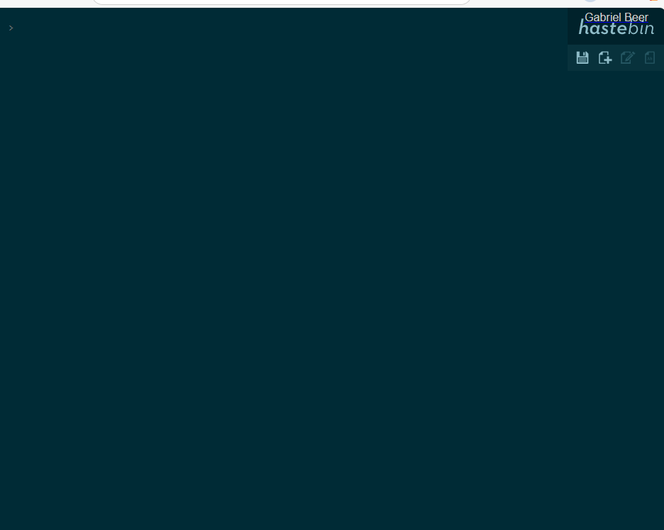

# Documentation - Conteneurisation Hastebin

## Étapes de construction et lancement avec Docker

### 1. Construction de l'image Docker

```bash
docker build -t hastebin-custom .
Cette commande :

- Lit le `Dockerfile` dans le répertoire courant
- Construit une image Docker nommée `hastebin-custom`
- Installe toutes les dépendances et applique les personnalisations
```

### 2. Lancement du conteneur

```bash
docker run -d -p 8085:8085 --name hastebin-container hastebin-custom
```

Cette commande :
- Lance le conteneur en mode détaché (`-d`)
- Mappe le port 8085 du conteneur vers le port 8085 de l'hôte (`-p 8085:8085`)
- Nomme le conteneur `hastebin-container`
- Utilise l'image `hastebin-custom`

### 3. Accès à l'application

Une fois le conteneur lancé, l'application est accessible via :
- **URL** : [http://localhost:8085](http://localhost:8085)
- **Port** : 8085

## Personnalisations appliquées

### 1. Configuration personnalisée (`config.json`)

- **Port d'écoute** : Modifié de `7777` à `8085`
- **Longueur des clés** : Réduite de `10` à `5` caractères
- **Taille maximale des messages** : Limitée à `10` caractères (au lieu de 400000)

### 2. Interface utilisateur (`index.html`)

- **Nom personnalisé** : Remplacement de "Colella" par "BeerGabriel"

### 3. Architecture du Dockerfile

Le Dockerfile suit une approche en couches optimisée :
1. **Image de base** : `node:18-alpine` pour une image légère
2. **Installation Git** : Nécessaire pour cloner le repository
3. **Clonage du code source** : Directement depuis GitHub
4. **Installation des dépendances** : Via `npm install`
5. **Copie des fichiers personnalisés** : Configuration et interface
6. **Exposition du port** : Port 8085
7. **Commande de démarrage** : `npm start`

## Captures d'écran commentées
On voit que tout fonctionne.

